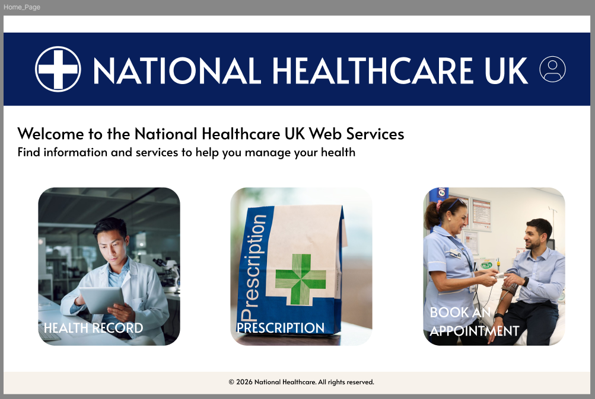

# Figma Preview

## Overview

This section contains the UI/UX design prototype for the Hospital Outpatient Booking System.
The design was created using Figma and shows the main user flow of the application.

---

## Figma Design Link

[View Figma Prototype](https://www.figma.com/proto/fMKG8hIGVpnAXfC5VEcEhe/Figma-basics?node-id=2651-12&t=PIIxvjmrwI02AKTK-1&scaling=scale-down&content-scaling=fixed&page-id=2609%3A1557&starting-point-node-id=2651%3A12&show-proto-sidebar=1)

---

## Screenshots

### Welcome Page

### Login Page

### Registration Page

### Home Page

### Details Page

### Appointment Page

### Profile Menu

### Modify Appointment

### Cancel Appointment

### Change Appointment

---

## Notes

These designs represent the intended user experience of the system.
Final implementation may vary during development.
